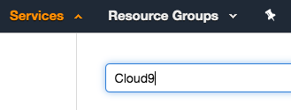
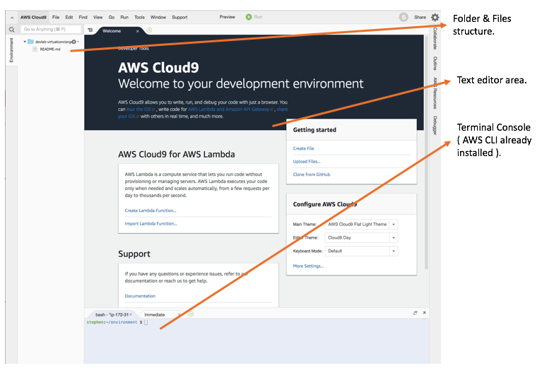
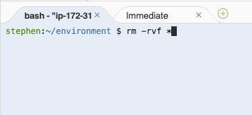
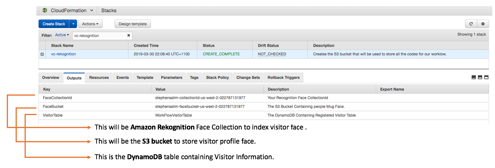
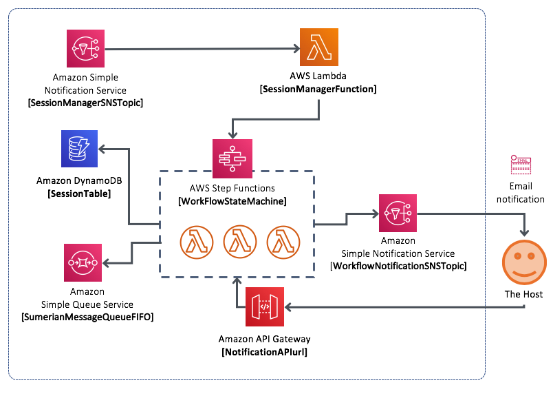
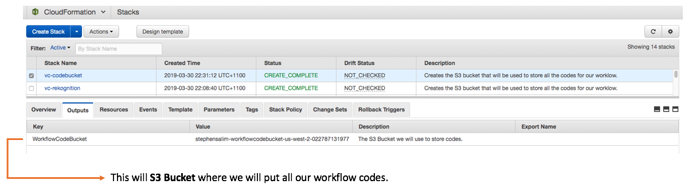
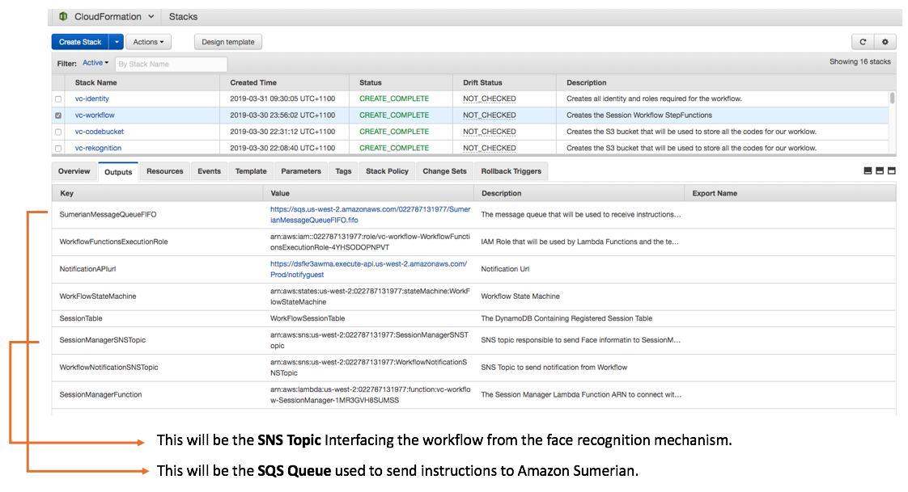
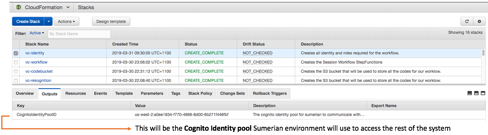

 


# **Welcome to "Building an AI Virtual Concierge" lab !**
By : Stephen Salim | AWS Partner Solutions Architect | Email : sssalim@amazon.com


In this lab you will be building a virtual concierge powered using [Amazon Sumerian](https://aws.amazon.com/sumerian/). We will be Levaraging AWS AI service, [Amazon Rekognition](https://aws.amazon.com/rekognition/), to allow your Sumerian to idenitfy who you are, greet you, check if you have an appointment, and notify a of your arrival.


 


The purpose of this lab is to showcase, one of the many possibilities you can integrate AWS services to create a customised concierge experience for your business need.
In this lab we have taken the assumption of a typical reception workflow. Where a reception see a guest, greets them, check if the guest has an appointment, and notify the host of guest's arrival. In practice, you could customise the workflow defined in [AWS StepFunction](https://aws.amazon.com/step-functions/) to do you see fit for your business. From sending email, making a phone call, or maybe... trigger your coffee machine to make you a coffee. The possibilies are endless .... **~(^0^)~** 

### **Note:**

We will be deploying services that may or may not be available on your typical AWS region of choice.
Therefore, putting your best experience in mind, we recommend running this lab in **us-west-2 ( Oregon Region )**

## **Step 1 - Preparing your workspace.** ( 2 mins )

First thing first, let's set up our work environment. For this we will be using [AWS Cloud9](https://aws.amazon.com/cloud9/) (cloud based IDE running on AWS) as our coding workstation. This is so that we have an isolated environment we could easily refresh for our next lab attendee. Don't worry ! this step won't take long, you'll be done before you know it. 

<details><summary>[ CLICK HERE ] for detailed steps</summary>
<p>

1. Access your IDE by clicking Services on [AWS Console](https://us-west-2.console.aws.amazon.com/).
2. In the Search bar type in Cloud9, highlight and click Cloud9 service shown.

	 

3. This should take you to the Cloud9 console.
4. Look for the `devlab-virtualconcierge` environment and click on **Open IDE**, you should then have access to the IDE through your web browser.

	

5. Notice that there are basically 3 different area in the IDE ( See above ). Files & Folder Structure on your left, Text Edit eara in the middle and Terminal in the bottom.
6. The terminal section will be the are you will be executing the commands in today's lab.
7. Lets start with a clean slate. Click on the Terminal section of the bottom of the IDE, type in below command to cleanup all files in the folder `rm -rvf *`

	

8. Once all files are cleaned download all the source codes into the environment from git repository. run this command below. 

	`git clone <gitrepo>`

9.  This should then create a folder called `devlabs-virtualconcierge`.
10. Type in `cd devlabs-virtualconcierge` in the terminal to change your directory to the folder.
11.	 For the rest of the lab, unless specified otherwise the commands to execute are to be executed from this folder. 
</p>
</details>

## **Step 2 - Deploying Face Rekognition.** ( 5 mins )

Now that we have our source code downloaded, we are ready to build !YEAH ! (If this doesn't make sense to you, or if you don't know where the source code is. Please go back and do **Step 1**).

The first thing we are going to build is the Face recognition services. The resource we are going to deployed in this step, will be used to Indentifying user Face, and Record the Visitor detail. Here are the list of services we will be using:

* [Amazon Rekognition](https://aws.amazon.com/rekognition/) This will be used to identify if visitor's face is known or unknown.
* [Amazon S3](https://aws.amazon.com/s3/) will be used store visitor profile picture. 
* [Amazon DynamoDB](https://aws.amazon.com/dynamodb/) will be used to store a visitor detail information.


<details><summary>[ CLICK HERE ] for detailed steps</summary>
<p>

1. To deploy this services let's deploy the cloudformation template called `vc-rekognition.yaml` in the root of `devlabs-virtualconcierge` folder.
2. Make sure you are in `devlabs-virtualconcierge` folder and execute below command in the Cloud9 Terminal (You can copy and paste this, but make sure to change the ParameterValue with your name).

	```
	aws cloudformation create-stack --stack-name vc-rekognition \
									--template-body file://vc-rekognition.yaml \
									--capabilities CAPABILITY_IAM \
									--parameters ParameterKey=YourFullName,ParameterValue=<your full name in lowercase>
	```
	Example:
	
	```
	aws cloudformation create-stack --stack-name vc-rekognition \
									--template-body file://vc-rekognition.yaml \
									--capabilities CAPABILITY_IAM \
									--parameters ParameterKey=YourFullName,ParameterValue=stephensalim
	```

Once the cloudformation stack is deployed you should see the AWS service resources deployed in your account.
To find out the information about resources deployed you can look at the CloudFormation Stack.
Please follow the step below to see the stack information and gather the necessary values for later use.


#### IMPORTANT

The Value of resources deployed in this step will be needed to configure the sumerian scene on step 4. Rather than coming back later to this step, I recommend to follow this step now and take note of the resource values.

To find out the information about resources deployed you can look at the CloudFormation Stack.
	
* Click Services on [AWS Console](https://us-west-2.console.aws.amazon.com/) in the Search bar type in CloudFormation, select and click CloudFormation service.
	
	

* Select the `vc-rekognition` stack and click on the output tab.

	

	Take note the value of : 
	
	* `FaceCollectionId `
	* `FaceBucket `
	* `VisitorTable `
	
	This will be needed to configure Sumerian in **Step 4** of this lab.


		
</p>
</details>
		
## **Step 3 - Deploying the Workflow.** ( 5 mins )

In this step we will be building the core workflow, orchestrating actions such as lookup appointment wait for host confirmation, as well as drop message to a queue for the Sumerian host to read. 

This workflow will receive an input containing face information from a face detection mechanism we built from the previous step. It will then provide instructions to our summerian host to read the appropriate action according to the flow. Here are the list of services we will be using:


* [Amazon DynamoDB](https://aws.amazon.com/dynamodb/) will be used to store session Database.
* [AWS Step Functions](https://aws.amazon.com/step-functions/) state machine to orchestrate the main activities.
* [AWS Lambda](https://aws.amazon.com/lambda/) functions to support the workflow, including a the session manager to execute the workflow.
* [Amazon Simple Notification Service](https://aws.amazon.com/sns/) to interface inbound channel to thr workflow as well as outbound notification.
* [Amazon Simple Queue Service](https://aws.amazon.com/sqs/) to interface messaging from workflow to the Sumerian environment.
* [Amazon API Gateway](https://aws.amazon.com/api-gateway/) to allow external service to response to the notification sent by the workflow.




<details><summary>[ CLICK HERE ] for detailed steps</summary>
<p>

1. In this step there will be a number of lambda functions that will support the workflow. The source code of those functions are located under the `workflow-lambda` folder.
2. Rather than packaging the functions one by one, we will levarage CloudFormation SAM to create a packaged template allowing our multiple lambda functions be deployed in one go.
3. First, we will need an S3 bucket to store our lambda functions. let's create the s3 bucket by deploying this cloudformation template `vc-codebucket.yaml`
4. Make sure you are in `devlabs-virtualconcierge` folder and execute below command in the Cloud9 Terminal (You can copy and paste this, but make sure to change the ParameterValue with your full name to make the bucket unique).

 
	```
	aws cloudformation create-stack --stack-name vc-codebucket \
									--template-body file://vc-codebucket.yaml \
									--capabilities CAPABILITY_IAM \
									--parameters ParameterKey=YourFullName,ParameterValue=<your full name in lowercase>
	```
	Example:
	
	```
	aws cloudformation create-stack --stack-name vc-codebucket \
									--template-body file://vc-codebucket.yaml \
									--capabilities CAPABILITY_IAM \
									--parameters ParameterKey=YourFullName,ParameterValue=stephensalim
	```
	
	Once the template is deployed you will see resources being deployed in your account.
	To find out the information about resources deployed you can look at the CloudFormation Stack.
	
	* Click Services on [AWS Console](https://us-west-2.console.aws.amazon.com/) in the Search bar type in CloudFormation, select and click CloudFormation service.
		
		
	
	* Select the `vc-codebucket` stack and click on the output tab take note of the `WorkflowCodeBucket`
		
		
	
5. Now that we have created the S3 Bucket, we will next package the lambda functions and prepare them to deployment. 
6. This step will basically uploads all the related lambda function to the S3 bucket specificed in one command, and create a packaged template `/tmp/vc-workflow.yaml.output` referencing to all the files uploaded in s3 ready to be deployed. (You can copy and paste this, but make sure to change the --s3-bucket calue with the s3 bucket created in previous step  with your `WorkflowCodeBucket `).


	```
	aws cloudformation package --template-file vc-workflow.yaml \
								--s3-bucket <Enter the WorkflowCodeBucket from step 5.1 above> \
								--output-template-file /tmp/vc-workflow.yaml.output
	```
	Example:
	
	```
	aws cloudformation package --template-file vc-workflow.yaml \
								--s3-bucket stephensalim-workflowcodebucket-us-west-2-022787131977 \
								--output-template-file /tmp/vc-workflow.yaml.output
	```
	
7. The previous step will produce `/tmp/vc-workflow.yaml.output` file, this is the packaged template that we can now deploy into CloudFormation. 
8. The next step is to deploy the packaged template.
9. You can copy and paste command below, but make sure to change the HostEmailAddress value to an email address you have access to. (This will basically emulate the email address our sumerian host will use to notify guest arrival).

	```
	aws cloudformation deploy --template-file /tmp/vc-workflow.yaml.output \
								--stack-name vc-workflow \
								--capabilities CAPABILITY_IAM \
								--parameter-overrides HostEmailAddress=<Email Address>
	```
	Example:
	
	```
	aws cloudformation deploy --template-file /tmp/vc-workflow.yaml.output \
								--stack-name vc-workflow \
								--capabilities CAPABILITY_IAM \
								--parameter-overrides HostEmailAddress=sssalim@demoemail.awsapps.com
	```

10. Wait until the stack deployed is complete, then follow the steps below.
11. Confirm Email SNS Notification.....


#### IMPORTANT

The Value of resources deployed in this step will be needed to configure the sumerian scene on step 4. Rather than coming back later to this step, I recommend to follow this step now and take note of the resource values.

To find out the information about resources deployed you can look at the CloudFormation Stack.
	
* Click Services on [AWS Console](https://us-west-2.console.aws.amazon.com/) in the Search bar type in CloudFormation, select and click CloudFormation service.
	
	

* Select the `vc-workflow` stack and click on the output tab take note of the value

	

	Take note the value of : 
	
	* `SessionManagerSNSTopic `
	* `SumerianMessageQueueFIFO `
	
	This will be needed to configure Sumerian in **Step 4** of this lab.
	
</p>
</details>

## **Step 4 - Deploying the Sumerian Resources.** ( 10 mins )

In this step we will be building the Amazon Sumerian environment and configuring the environment so that it can connect to the rest of the workflow. If we have 2 hours to run this lab, we would go through building the sumerian scene from scratch. Since we only have limited time, I have packaged the sumerian scene in a zip file ready for you to import and configure. Sumerian is based in javascript, and in our scene today there will be a number of scripts that are basically responsible to do the following.

**WebCam Script**

* Capture visitor face from WebCam, Find a match in Amazon Recognition Collection & Visitor database then send Notification to the Session Manager SNS topic to trigger the workflow.

**Registration Script**

* Capture visitor face from WebCam, Register face in Amazon Recognition Collection & Visitor database then send Notification to the Session Manager SNS topic to trigger the workflow.

**Message Pooler Script**

* Poll SQS message for any new message from the workflow and then trigger Read & Display Message script

**Message Pooler Script**

* Execute Sumerian host to speak the message, and display information in scene.

To enable all the above Sumerian scene will need access AWS service api with the approproate credential. and to facilitate that we will be using [Amazon Cognito](https://aws.amazon.com/cognito/) identitiy pool.

Here are the key services we will deploy in this step.

* [Amazon Cognito](https://aws.amazon.com/cognito/) to provide access for our sumerian scene to AWS APIs including to start the workflow.
* [Amazion Sumerian](https://aws.amazon.com/sumerian/) used to provide an representation of virtual host for the user. 


<details><summary>[ CLICK HERE ] for detailed steps</summary>
<p>

### Creating Identity Pool

1. Deploy the cloudformation template called `vc-identity.yaml` to create cognito identitiy pool resources.

	```
	aws cloudformation create-stack --stack-name vc-identity \
									--template-body file://vc-identity.yaml \
									--capabilities CAPABILITY_IAM
	```
						
#### IMPORTANT

The Value of resources deployed in this step will be needed to configure the sumerian scene on step 4. Rather than coming back later to this step, I recommend to follow this step now and take note of the resource values.

To find out the information about resources deployed you can look at the CloudFormation Stack.
	
* Click Services on [AWS Console](https://us-west-2.console.aws.amazon.com/) in the Search bar type in CloudFormation, select and click CloudFormation service.
	
	
	 
* Select the `vc-identity` stack and click on the output tab take note of the 
	
	
		
	Take note the value of : 
	
	* `CognitoIdentityPoolID`
	
	This will be needed to configure Sumerian identitiy pool later in this step.


### Importing & Configuring Sumerian Scene

1. Finally, lets access Sumerian. From [AWS Console](https://us-west-2.console.aws.amazon.com/) in the Search bar type in Sumerian, select and click Sumerian service.

	

2. You should then be taken to the Sumerian Console (as per below). Click **Create New Scene**, 

	

3. Enter `<Your full name>-devlabs-vcdemo` as the scene name, then click **Create **to start a blank scene.

	

4. Click **Import Asset**.

	

5. Click **Browse** and select the Zip file in `~/devlabs-virtualconcierge/sumerian-bundle`, or just drag the Zip file to the Drop your file here... area.

	

7. This will then load the entire asset in the bundle to the scene. Depending on the internet speed the loading of the scene might take up to 5 minutes. Once the scene is fully loaded you should see all the entities populated on the left hand side if the menu. 

	

8. Click on the **VCCamera** entity press **F** in your keyboard and scroll up your mouse until you see your host in the scene.

9. Select the **VCCamera** entity in the left menu, then tick the **Main Camera** option on the right hand side menu. This will basically set the scene to use the entity called `Main Camera` as the default camera to load the scene

	
	
10. Try clicking the play button on the scene, If you correctly set the camera up, your scene should automatically load with the host zoomed in like below. Once you confirm this, stop by pressing the stop button in the scene.

	

	

11. Select the **Text Editor** by clicking on Tools on the top left bar of the editor, then **Text Editor**. Alternatively, Press **J** in your keyboard. This should take you to the text editor where you can edit the HTML element as well as JavaScripts you embed into the scene.

	
	
12. Select the **Parameter Loader** script. This script is responsible in loading all reference to the workflow resources in the scene.
13. Change the value of each of the variables with the designated values you took note from CloudFormation in previous steps.
	
	
	
	Here's a code snippet you can copy and paste.
	Replace the variable value with the resources valued deployed in step 2 and 3. 
	Make sure there are no space before or after the ' ' sign
	
	```
	ctx.worldData.mugfacebucket = '< Replace with Value of FaceBucket in Step 2 >'
	ctx.worldData.facecollection = '< Replace with Value of FaceCollectionId in Step 2 >'
	ctx.worldData.visitortable = '<Replace with Value of VisitorTable in Step 2 >'
	ctx.worldData.facesnstopicArn = '<Replace with Value of SessionManagerSNSTopic in Step 3 >'
	ctx.worldData.messagequeue = '<Replace with Value of SumerianMessageQueueFIFO in Step 3 >'
	```
	
	Once you configured them correctly it should look like this.
	
	
12. Press **ctrl+s** (Windows) or **command+s** (Mac) in the Text Editor to save all changes. (Make sure the text editor indicator is set to green. )


	

13. Now that all reference to the workflow is configured, the next thing to do is to provide Amazon Sumerian access to those resources. And we do this by referncing the Cognito Identity Pool we created earlier at the begining of this step.
14. Click on the root of your entity scene, then on the right hand menu expand the AWS Configuration section. Look for Cognito Identity Pool ID, Paste in the value of `CognitoIdentityPoolID` you took note earlier in this step.

	

15. Press **ctrl+s** (Windows) or **command+s** (Mac) in the Text Editor to save all changes.

	


</p>
</details>

## **Step Final - Test.**

Once you followed Step 1 - 4 above, now it is time to see it in action.

 

<details><summary>[ CLICK HERE ] for detailed steps</summary>
<p>

1. Click on the Play Icon on the Scene.

	

2. Position your face into the WebCam, then click on the camera icon to take a snap picture.

	 

3. If you would like to retake the picture click on "cross" button otherwise press the "check" button if you are ready to continue.

	 

8. At this point the **WebCamScript** will check your face against the `FaceCollectionId ` you on step 2 and it will send the result to your SNS notification to trigger the workflow `SessionManagerSNSTopic `.

9. This will in turn trigger the event in StepFunction specified in `WorkFlowStateMachine` value (deployed in step 3).

10. (Optional) If you would like to take a look on what the flow looks like in the state machine follow below steps:

	* Click Services on [AWS Console](https://us-west-2.console.aws.amazon.com/) in the Search bar type in Step Functions, select and click CloudFormation service.
	
		
	 
	* This will take you to the StepFunction Console.
	* Locate the State Machine you've created, if you follow the steps above you should see one with `WorkFlowStateMachine-` prefix. click on the State Machine name.

		
		
	* Locate for the latest execution and click on the ID.
	 
	 	
	 	
	* You should now see a section in the console with a flowchart looking graph. If you expand it, you should be able to see the steps that occured in the background and it should tell you a story on the scenario that has occured.
	
		
	
	* Because at the moment the `FaceCollectionId` is empty, your face are not recognised. What happened here is the workflow entered a state for unknown face and it has sent an SQS message `SumerianMessageQueueFIFO ` with instructions to show the registration page on the Sumerian scene, and for the host to say the message. 

11. So you should now see the registration page hanging on your scene.
12. Go ahead and pose for the best mug shot on the planet, click on the "camera" button, type in your name, and click submit. 

	

13. Once you click Submit, at this point the `RegistrationScript` in Sumerian will register your mug shot to the `FaceCollectionId`, upload your mug shot into the `FaceBucket` bucket deployed on step2. Once that's done it will then send the SNS notification `SessionManagerSNSTopic ` to trigger the workflow again.

14. This time, your sumererian host should know your name, greet you and check for your appointment.

15. And if you then trace back to the State machine workflow following steps described in 5.10 you should see a workflow that looks like this.

	

16. The flow basically enters a different path of the workflow, Lookup for appointment, send different action to Sumerian and also, sent an email to the email address you've specified when building step 4. So check your email and look for an email from the SNS Topic.

**Note:**

If you are wondering how does the workflow knows if you have an appointment or not. It is basically hardcoded in function that backs Lookup Appointment state `~/workflow-lambda/appointmentlookup.py`. The purpose of this lab is to showcase how we can integrate the workflow into sumerian, and we have a very limited time to work with. You could potentially extend this function to actually call out a real appointment API ).

17. In your email you should receive a notification with 2 urls. These uri are basically prepopulated to trigger `NotificationAPIurl` api gateway which will ultimately trigger our State Machine to continue it's path. At the moment it is waiting for the host to confirm that they are coming up to pick you "the visitor".

	

18. Just for fun however, don't click anything yet. ignore this email, and take another face capture from the scene. this is basically to emulate the behaviour that the Sumerian host has identified you once again and but the host has not respond to the email. Basically repeat step 5.2 and 5.3.

19. Your Sumerian host should say that "Your host has not responded yet and is sending him a reminder."

20. If you look at your workflow now, it should enters another different path.

	

21. If you now check your email, you should be able to see a new Notification email.

22. Finally you can go ahead and click one of the link in the email. and see how your sumerian host respond. 

	

**Note:**

If you would like to publish this scene into a real external url
Please follow [this guide](https://docs.aws.amazon.com/sumerian/latest/userguide/editor-publish.html)

</p>
</details>

--

**That's all folks !**

I hope this lab has been fun, and useful.
I certainly had lots of fun building it. I would love to hear your feedback on the things that you found to be good and could be improved. If you are inclined, please drop me an email and let me know your feedback.


