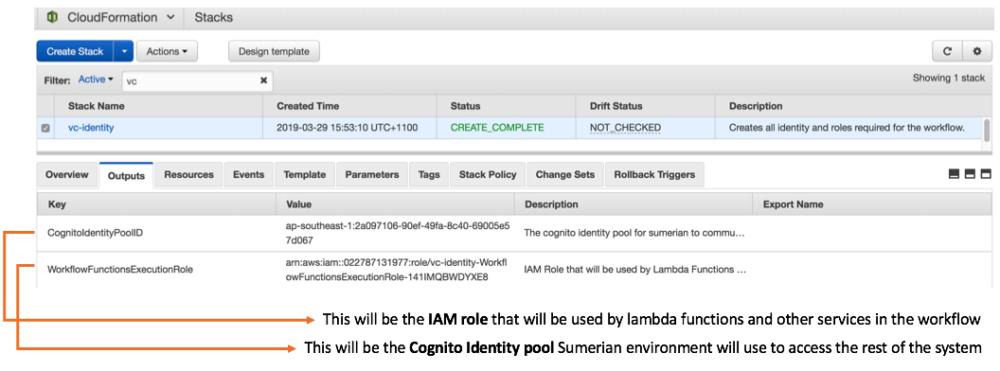
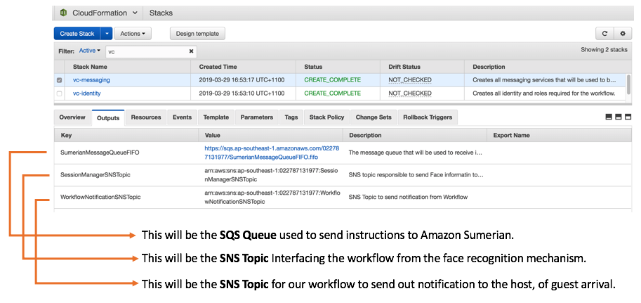
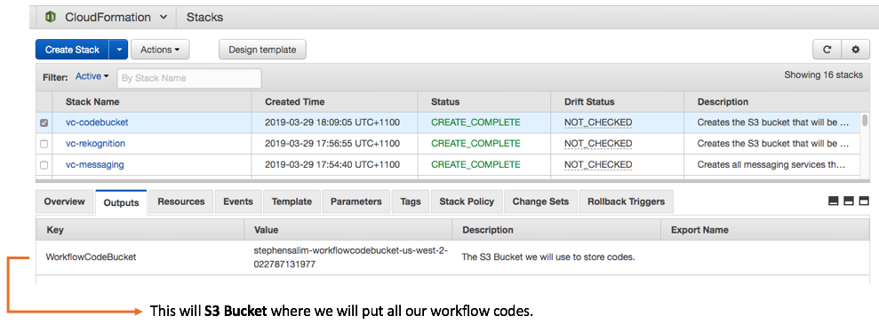
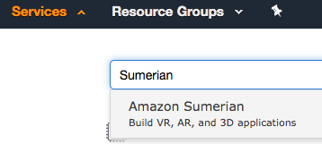
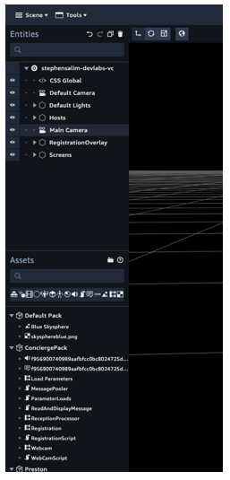

# Building an AI Virtual Concierge Experience.

 


Region To Pick !!!


## **Welcome to the lab ! Are you ready to build ?**

In this lab you will be building a virtual concierge host using [Amazon Sumerian](https://aws.amazon.com/sumerian/). Levaraging AWS AI service, [Amazon Rekognition](https://aws.amazon.com/rekognition/), your Sumerian host will be able to idenitfy who you are, greet you, check if you have an appointment, and notify the person of your arrival.

The purpose of this lab is to showcase to you one of the many possibiltis you can integrate AWS services to create a customised experience for your business need.

In this lab we have taken the assumption of a typical reception workflow where a reception see a guest, greets them, check if the guest has an appointment, and notify the host of guest's arrival. 

In practice, you could customise the workflow defined in [AWS StepFunction](https://aws.amazon.com/step-functions/) to whatever you see fit for your business. From notifying guest arrival, sending email, making a phone call, or maybe trigger a rasberry pi to make coffee for you. The possibilies are truly endless !! Wohoo... squid dance ~~ **~(^0^)~**

OK Let's get cracking !

## **Step 1 - Preparing your workspace.** ( 2 mins )

In this lab we will be using [AWS Cloud9](https://aws.amazon.com/cloud9/) (cloud based IDE running on AWS) as our coding workstation. This is so that we have an isolated coding environment we could easily re-use for the lab. 

<details><summary>[ CLICK HERE ]</summary>
<p>

1. To access your IDE click Services on [AWS Console](https://us-west-2.console.aws.amazon.com/) in the Search bar type in Cloud9, select and click Cloud9 service.

	 

2. Look for the `devlab-virtualconcierge` and click on **Open IDE** you should then have access to the IDE through your web browser.

	

3. On the terminal section of the bottom of the IDE, type in below command to cleanup all files in the folder `rm -rvf *`

	

4. Once all files are cleaned download all the source codes into the folder from git repository. `git clone <gitrepo>`

5. Type in `cd devlabs-virtualconcierge`

6. Now that all the codes are downloaded we are ready to work !
</p>
</details>

## **Step 2 - Deploying Identity and Roles.** ( 2 mins )

The first thing we will create in our solutions are the security resources. 
These security resources are responsible for the level of access our solution has between each elements and other AWS services. 

<details><summary>[ CLICK HERE ]</summary>
<p>

1. To do this let's deploy the cloudformation template called `vc-identity.yaml`.

	```
	aws cloudformation create-stack --stack-name vc-identity \
									--template-body file://vc-identity.yaml \
									--capabilities CAPABILITY_IAM
	```
						
	
	Once the template is deployed you will see 2 resources being deployed in your account. An [Amazon Cognito](https://aws.amazon.com/cognito/) Identitiy pool and an [AWS IAM](https://docs.aws.amazon.com/IAM/latest/UserGuide/introduction.html) role. The Identity pool will be used by Sumerian later in the process to assume access to the rest of AWS services. The IAM role will be used by [AWS Lambda](https://aws.amazon.com/lambda/) Functions and [AWS StepFunction](https://aws.amazon.com/step-functions/), [Amazon API Gateway](https://aws.amazon.com/api-gateway/) to execute the workflow activities.  
	
	To find out the information about resources deployed you can look at the CloudFormation Stack.
	
	* Click Services on [AWS Console](https://us-west-2.console.aws.amazon.com/) in the Search bar type in CloudFormation, select and click CloudFormation service.
	
		
	 
	* Select the `vc-identity` stack and click on the output tab take note of the `CognitoIdentityPoolID ` and `WorkflowFunctionsExecutionRole ` value.
	
		
		
</p>
</details>
		

## **Step 3 - Deploying Messaging Service.** ( 2 mins )

Our Virtual concierge workflow will basically receive an input containing face information from a face detection mechanism and then provide instructions to our summerian host on what needs to be done next. To decouple between face detection architecture, workflow, Amazon Sumerian, we will levarage two AWS messaging services orchestrate message in the workflow. [Amazon Simple Notification Service](https://aws.amazon.com/sns/) will be used to receive message from face detection mechanisem and pass it on to the workflow and [Amazon Simple Queue Service](https://aws.amazon.com/sqs/) will be used as a mechanism to send instuctions to our sumerian host on what they need to do, in this case what message they need to speak.

<details><summary>[ CLICK HERE ]</summary>
<p>

1.  To deploy this services let's deploy the cloudformation template called `vc-messaging.yaml`

	```
	aws cloudformation create-stack --stack-name vc-messaging \
									--template-body file://vc-messaging.yaml
	```
	
	Once the template is deployed you will see resources being deployed in your account.
	To find out the information about resources deployed you can look at the CloudFormation Stack.
	 
	* Select the `vc-messaging` stack and click on the output tab take note of the `SumerianMessageQueueFIFO `,`SessionManagerSNSTopic `,`WorkflowNotificationSNSTopic` value.
	
		

</p>
</details>

## **Step 4 - Deploying Face Recognition resources.** ( 3 mins )

In this step we will be deploying all the resources needed Index faces that we capture. this will include an [Amazon Rekognition](https://aws.amazon.com/rekognition/) face collection resource as well as an S3 bucket that will be used to store visitor profile picture.

<details><summary>[ CLICK HERE ]</summary>
<p>

1.  To deploy this services let's deploy the cloudformation template called `vc-rekognition.yaml`

	```
	aws cloudformation create-stack --stack-name vc-rekognition \
									--template-body file://vc-rekognition.yaml \
									--capabilities CAPABILITY_IAM \
									--parameters ParameterKey=YourFullName,ParameterValue=<your full name in lowercase>
	```
	Example:
	
	```
	aws cloudformation create-stack --stack-name vc-rekognition \
									--template-body file://vc-rekognition.yaml \
									--capabilities CAPABILITY_IAM \
									--parameters ParameterKey=YourFullName,ParameterValue=stephensalim
	```
	
	Once the template is deployed you will see resources being deployed in your account.
	To find out the information about resources deployed you can look at the CloudFormation Stack.
	 
	* Select the `vc-rekognition` stack and click on the output tab take note of the `FaceCollectionId `,`FaceBucket ` value.
	
		

</p>
</details>

## **Step 5 - Deploying the Workflow.** ( 5 mins )

Alright we are getting there ! In this step we will be building the core workflow our solutions use to orchestrate messaging and action to Amazon Sumerian.
This step will include building Session and Visitor Database using [Amazon DynamoDB](https://aws.amazon.com/dynamodb/), [Amazon API Gateway](https://aws.amazon.com/api-gateway/) to allow external service to response to the notification sent by the workflow. The Workflow StateMachine using [AWS Step Functions](https://aws.amazon.com/step-functions/).

Let's do this !

<details><summary>[ CLICK HERE ]</summary>
<p>

1.  First step to this, let's create the s3 bucket where we will deploy our lambda functions `vc-codebucket.yaml`

	```
	aws cloudformation create-stack --stack-name vc-codebucket \
									--template-body file://vc-codebucket.yaml \
									--capabilities CAPABILITY_IAM \
									--parameters ParameterKey=YourFullName,ParameterValue=<your full name in lowercase>
	```
	Example:
	
	```
	aws cloudformation create-stack --stack-name vc-codebucket \
									--template-body file://vc-codebucket.yaml \
									--capabilities CAPABILITY_IAM \
									--parameters ParameterKey=YourFullName,ParameterValue=stephensalim
	```
	
	Once the template is deployed you will see resources being deployed in your account.
	To find out the information about resources deployed you can look at the CloudFormation Stack.
	 
	* Select the `vc-codebucket` stack and click on the output tab take note of the `WorkflowCodeBucket`
		
	
2.  Second Step is to package the functions and prepare them to deployment. This step will basically uploads all the related lambda function to the S3 bucket specificed, and create a packaged template `/tmp/vc-workflow.yaml.output` referencing to all the files uploaded in s3.

	```
	aws cloudformation package --template-file vc-workflow.yaml \
								--s3-bucket <Enter the WorkflowCodeBucket from step 5.1 above> \
								--output-template-file /tmp/vc-workflow.yaml.output
	```
	Example:
	
	```
	aws cloudformation package --template-file vc-workflow.yaml \
								--s3-bucket stephensalim-workflowcodebucket-us-west-2-022787131977 \
								--output-template-file /tmp/vc-workflow.yaml.output
	```
	
3. Once the `/tmp/vc-workflow.yaml.output` is ready, the next step is to actually deploy the packaged template, and referncing the messaging and identitiy resources we created in previous steps.

	```
	aws cloudformation deploy --template-file /tmp/vc-workflow.yaml.output \
								--stack-name vc-workflow \
								--capabilities CAPABILITY_IAM \
								--parameter-overrides SumerianMessageQueueFIFO=<SumerianMessageQueueFIFO value in step 3 > \
								WorkflowNotificationSNSTopic=<Value of WorkflowNotificationSNSTopic in step 3 > \
								WorkflowFunctionsExecutionRole=<Value of WorkflowFunctionsExecutionRole in step 2>
	```
	Example:
	
	```
	aws cloudformation deploy --template-file /tmp/vc-workflow.yaml.output \
								--stack-name vc-workflow \
								--capabilities CAPABILITY_IAM \
								--parameter-overrides SumerianMessageQueueFIFO=https://sqs.us-west-2.amazonaws.com/022787131977/SumerianMessageQueueFIFO.fifo \
								WorkflowNotificationSNSTopic=arn:aws:sns:us-west-2:022787131977:SessionManagerSNSTopic \
								WorkflowFunctionsExecutionRole="arn:aws:iam::022787131977:role/vc-identity-WorkflowFunctionsExecutionRole-1NWSJE8ZXETSZ"
	```
	
	Once the template is deployed you will see resources being deployed in your account.
	To find out the information about resources deployed you can look at the CloudFormation Stack.
	 
	* Select the `vc-workflow` stack and click on the output tab take note of the `WorkflowCodeBucket`
		
		
		
</p>
</details>

## **Step 6 - Deploying the Sumerian Scene.** ( 10 mins )

In this step we will be building the Amazon Sumerian environment and configuring the environment so that it can connect to the rest of the workflow. 

<details><summary>[ CLICK HERE ]</summary>
<p>

1. To access Sumerian Services on [AWS Console](https://us-west-2.console.aws.amazon.com/) in the Search bar type in Sumerian, select and click Sumerian service.

	

2. You should then be taken to the Sumerian Console (as per below). Click **Create New Scene**, 

	

3. **Download** the Sumerian Scene bundle [here]()

4. enter `<Your full name>-devlabs-vcdemo` as the scene name, then click **Create **to start a blank scene.

	

5. Click **Import Asset**.

	

6. Click **Browse** and select the Zip file downloaded in Step 6.4 above, or just drag the Zip file to the Drop your file here... area.

	

7. Depending on the internet speed the loading of the scene might take up to 5 minutes.
(While waiting you can execute #Step7 - Connect the plug if you prefer.) 
Once the scene is fully loaded you should see all the entities populated on the left hand side if the menu. 

	

8. Click on the **Main Camera** entity press **F** in your keyboard and scroll up your mouse until you see your host in the scene.

9. Select the **Main Camera** as shown in the screen shot below, this will basically set the scene to use the entity called Main Camera as the default camera to load the scene

	
	
10. Try clicking the play button on the scene, If you correctly set the camera up, your scene should automatically load like below. 

	

11. Select the Text Editor by clicking on Tools then Text Editor or Press **J** in your keyboard. This should take you to the text editor where you can edit the HTML element as well as JavaScripts you embed into the scene.

</p>
</details>
## **Step 7 - Connect the plug.**

## **Step 8 - Lets Test this baby.**